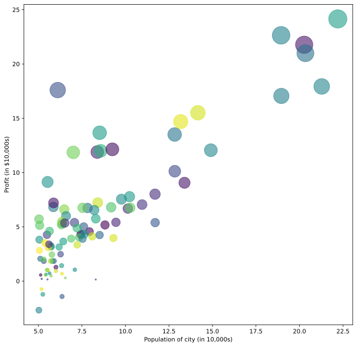

# Machine Learning

## Supervised Learning

### Problem

Given the training set 
- *m* : number of training set
-  : input values
-  : output values

### Objective

Find the function to predict  from  so that  is minimal.
-  measures the difference between predicted values  and .

- The formula of  depends on the type of problem.
    - Linear Regression:
    

-
    - Logistic Regression:
    

-  : predicted value.
-  : hypothesis function. Its formula depends on the type of problem.
    - Linear Regression:
    

-
    - Logistic Regression:
    

-  : feature vector
-  : parameter vector

-  : number of features.

### Gradient Descent

Gradient Descent is an algorithm to find  so that  is minimal.

**Algorithm:**

repeat until  {

 

}  (simultaneously update )

-  : number of features
-  : learning rate
-  : convergence condition

From the formula of , they found the formula below is correct in both cases of linear and logistic regression.

Do **vectorization**, we have the algorithm gradient descent is:

repeat until  {

}

## Linear Regression

In this section, I'll talk about the programming exercise of week 2. The code source is rewritten in Python at [linear regression](linear%20regression.ipynb). If you want to refer to Matlab codes, they are in the diretory [w2](w2/).

In general, the workflow of two assignments (linear regression with one variable and linear regression with multiple variables) is presented in the figure below.

It consists of four steps:
- Load Data: load data from text files, `ex1data1.txt` and `ex1data2.txt`.
- Define functions: define functions to predict outputs, to compute cost, to normalize features, and to carry out the algorithm gradient descent.
- Prepare Data: add column of ones to variables, do normalize features if needed.
- Training: initialize weights, learning rate, and number of iterations (called *epochs*) then lauch gradient descent.

Finally, I do one more step visualization to figure out the result obtained.

### Linear Regression with one variable

In this assignment, you need to predict profits for a food truck. Suppose you are the CEO of a restaurant franchise and considering different cities for opening a new outlet. The chain already has trucks in various cities and you have data for profits and populations from the cities. They are presented in the figure below. A negative value for profit indicates a loss.

