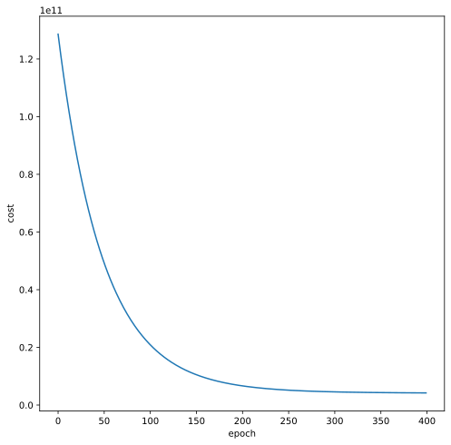
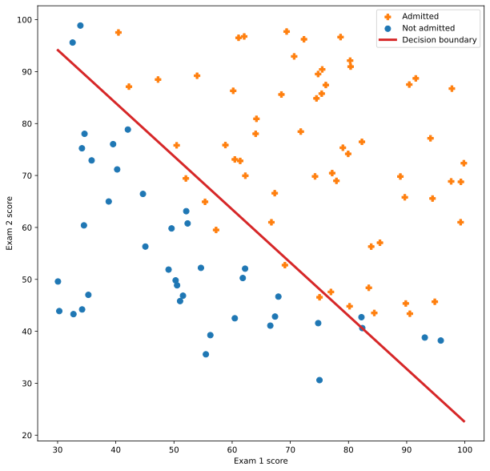

# Machine Learning

1. [Supervised Learning](#supervised-learning)
2. [Linear Regression](#linear-regression)
3. [Logistic Regression](#logistic-regression)

## Supervised Learning

### Problem

Given the training set 
- *m* : number of training set
-  : input values
-  : output values

### Objective

Find the function to predict  from  so that  is minimal.
-  measures the difference between predicted values  and .
<p align="center">

</p>

- The formula of  depends on the type of problem.
    - Linear Regression:
    <p align="center"></p>

-
    - Logistic Regression:
    <p align="center"></p>
-  : predicted value.
-  : hypothesis function. Its formula depends on the type of problem.
    - Linear Regression:
    <p align="center"></p>

-
    - Logistic Regression:
    <p align="center"></p>

-  : feature vector
-  : parameter vector
<p align="center">

</p>

-  : number of features.

### Gradient Descent

Gradient Descent is an algorithm to find  so that  is minimal.

<p align="center">

</p>

**Algorithm:**

repeat until  {

 

}  (simultaneously update )

-  : number of features
-  : learning rate
-  : convergence condition


From the formula of , they found the formula below is correct in both cases of linear and logistic regression.

<p align="center">

</p>

Do **vectorization**, we have the algorithm gradient descent is:

repeat until  {


}

## Linear Regression

In this section, I'll talk about the programming exercise of week 2. The code source is rewritten in Python using [NumPy](https://numpy.org/). I avoid using frameworks like [PyTorch](https://pytorch.org/) since they are too powerful in comparison with these exercises.

The code source is in the Jupyter notebook [linear regression](linear%20regression.ipynb). If you want to refer to Matlab codes, they are in the directory [w2](w2/).

In general, the workflow of two assignments (linear regression with one variable and linear regression with multiple variables) is presented in the figure below.

<p align="center">

</p>

It consists of four steps:
- Load Data: load data from text files: `ex1data1.txt` and `ex1data2.txt`.
- Define functions: define functions to predict outputs, to compute cost, to normalize features, and to carry out the algorithm gradient descent.
- Prepare Data: add a column of ones to variables, do normalize features if needed.
- Training: initialize weights, learning rate, and a number of iterations (called *epochs*), then launch gradient descent.

Finally, I do one more step visualization to figure out the result obtained.

### Linear Regression with one variable

In this assignment, you need to predict profits for a food truck.

Suppose you are the CEO of a restaurant franchise and considering different cities for opening a new outlet. The chain already has trucks in various cities, and you have data for profits and populations from the cities.

The data set is stored in the file `ex1data1.txt` and is presented in the figure below. A negative value for profit indicates a loss.

<p align="center">

</p>

#### Load data

```Python
DATA_FILE = "w2/ex1data1.txt"
data = np.loadtxt(DATA_FILE, delimiter=",")
data[:5,:]
X = data[:,1]  # population
Y = data[:,2]  # profit
```
- The numpy method `loadtxt()` loads data from a text file to a numpy array.

#### Define functions

```Python
def predict(X, w):
    Yh = np.matmul(X, w)
    return Yh

def cost_fn(X, w, Y):
    Yh = predict(X, w)
    D = Yh - Y
    cost = np.mean(D**2)
    return cost

def gradient_descent(X, Y, w, lr, epochs):
    logs = list()
    m = X.shape[0]
    for i in range(epochs):
        # update weights
        Yh = predict(X, w)
        w = w - (lr/m)*np.matmul(X.T,(Yh-Y))
        # compute cost
        cost = cost_fn(X, w, Y)
        logs.append(cost)
    return w, logs
```
- The numpy method `matmul()` performs a matrix product of two arrays.

#### Prepare data

```Python
X = np.column_stack((np.ones(X.shape[0]), X))  # add column of ones to X
X[:5,]
```
- The numpy method `column_stack()` stacks a sequence of 1-D or 2-D arrays to a single 2-D arrays.

#### Training

```Python
w = np.zeros(X.shape[1])  # weights initialization
lr = 1e-2  # learning rate
epochs = 1500  # number of iteration
w, logs = gradient_descent(X, Y, w, lr, epochs)
```

After 1500 iterations, we will obtain the new weights `w`
```
array([-3.63029144,  1.16636235])
```

The line predicted is shown in the figure below.

<p align="center">

</p>

And the figure below figures out the variation of cost.

<p align="center">

</p>

### Linear Regression with multiple variables

In this assignment, you need to predict the prices of houses.

Suppose you are selling your house and you want to know what a good market price would be. The file `ex1data2.txt` contains a data set of housing prices in Portland, Oregon. The first column is the size of the house (in square fit), the second column is the number of bedrooms, and the third column is the price of the house.

The figure below presents the data set in 3D space.

<p align="center">

</p>

There's only one point that we need to pay attention to: house sizes are about 1000 times the number of bedrooms. Therefore, we should perform feature normalization before launching gradient descent so that it converges much more quickly.

Create the function `normalize_features()`
```Python
def normalize_features(X):
    mu = np.mean(X, axis=0)
    std = np.std(X, axis=0)
    X_norm = (X - mu)/std
    return X_norm
```

Then normalize variables before put them in gradient descent.
```Python
X_norm = normalize_features(X)
X_norm = np.column_stack((np.ones(X_norm.shape[0]), X_norm))
```

The other steps are completely similar to the ones of the assignment above. We don't need to rewrite functions `predict()`, `cost_fn()`, and `gradient_descent()` since they work well with matrices multi-columns.

```Python
w = np.zeros(X_norm.shape[1])  # weights initialization
lr = 1e-2  # learning rate
epochs = 400  # number of iterations
w, logs = gradient_descent(X_norm, Y, w, lr, epochs)
```

After 400 iterations, we have the surface of prediction in the figure below.

<p align="center">

</p>

Intuitively, linear regression prediction with one variable is a line in the surface of inputs and outputs. The prediction of two variables is the surface. The prediction of the three variables is space, and so on.

The gradient descent logs help us figure out the variation of our model's cost in the figure below.

<p align="center">

</p>

## Logistic Regression

This section mentions the programming exercise of week 3. These assignments' workflow is similar to the one of linear regression and is presented in the figure below.

<p align="center">

</p>

It consists of four main steps:
- Load Data: load data from text files: `ex2data1.txt` and `ex2data2.txt`
- Define functions: define functions to estimate outputs, compute cost, gradients, etc.
- Prepare Data: prepare data for optimization.
- Optimization: initialize weights and launch the optimizing function. In this step, we will use the built-in function named [fmin_tnc](https://docs.scipy.org/doc/scipy/reference/generated/scipy.optimize.fmin_tnc.html) to find optimal weights.

### Logistic Regression without regularization

In this part, we will build a logistic regression model to **predict whether a student is admitted in to a university**.

Suppose that you are the university department administrator and want to determine each applicant's admission chance based on their results on two exams.

You have historical data from previous applicants. In the text file `ex2data1.txt`, it contains the applicant's scores on two exams (in the first two columns) and the admission decision (the third column).

The figure below presents your data intuitively.

<p align="center">

</p>

#### Load data
```Python
DATA_FILE = "w3/ex2data1.txt"
data = np.loadtxt(DATA_FILE, delimiter=",")
data[:5,:]
X = data[:,:2]  # exam scores
Y = data[:,2]  # admission decision
```

In this part, we load data from the text file `ex2data1.txt` into NumPy variables `X` and `Y`.

#### Define functions
```Python
def sigmoid(Z):
    return 1/(1+np.exp(-Z))

def estimate(w, X):
    Z = np.matmul(X, w)
    Yh = sigmoid(Z)
    return Yh

def cost_func(w, X, Y):
    Yh = estimate(w, X)
    c0 = -np.matmul(Y.T, np.log(Yh))
    c1 = -np.matmul((1-Y).T, np.log(1-Yh))
    cost = (c0 + c1)/len(X)
    return cost

def gradient(w, X, Y):
    Yh = estimate(w, X)
    D = Yh - Y
    grad = np.matmul(X.T, D)/len(X)
    return grad

def predict(w, X):
    Yh = estimate(w, X)
    P = np.array([1. if p >= 0.5 else 0. for p in Yh])
    return P
```

In this part, we define functions:
- `estimate()` is to compute the probability of admission from exams' scores and the weights.
- `cost_func()` is to compute the cost of estimation.
- `gradient()` returns the gradients of cost function.
- `predict()` returns the prediction of an admission decision.

As we will use the SciPy fuction [fmin_tnc](https://docs.scipy.org/doc/scipy/reference/generated/scipy.optimize.fmin_tnc.html) to optimze the weights, the parameters of functions `cost_func()` and `gradient()` needs to respect its rule: the weights first, then the inputs, the outputs.

#### Prepare data
```Python
X = np.column_stack((np.ones(X.shape[0]), X))
```

We add a column of ones into `X`.

#### Optimization
```Python
w = np.zeros(X.shape[1])  # initialize weights
w_opt,_,_ = opt.fmin_tnc(func=cost_func, x0=w, fprime=gradient, args=(X, Y))
```

We call the SciPy function [fmin_tnc](https://docs.scipy.org/doc/scipy/reference/generated/scipy.optimize.fmin_tnc.html) to find the optimal weights. This function needs four inputs:
- `func` : the function to optimize. In our case, it's the function `cost_func()`.
- `x0`: the initial estimate of the minimum. It's the weights `w` in our case.
- `fprime`: the function to compute the gradients of the function in `func`. In our case, it's the fuction `gradient()`.
- `args`: arguments to pass to functions in `func` and `fprime`. It's `X` and `Y` in our case.

The optimal weights are returned in `w_opt`. We found the training accuracy is 89% and the decision boundary is shown in the figure below.

<p align="center">

</p>

### Regularized Logistic Regression

In this part, we will implement regularized logistic regression to **predict whether microchips from a fabrication plant pass quality assurance (QA).** During QA, each microchip goes through various tests to ensure it is functioning correctly.

Suppose you are the factory's product manager, and you have the test results for some microchips on two different tests. From these two tests, you would like to determine whether the microchips should be accepted or rejected.

The dataset of test results on past microchips is in the text file `ex2data2.txt`. The figure below presents the dataset intuitively.

<p align="center">

</p>

The figure shows that the dataset cannot be separated by a straight-line. A straight-forward application of logistic regression will not perform well on this dataset since *logistic regression will only find a linear decision boundary*.

One way to fit the data better is to create more features from each data point. We will create a function named `map_feature()` to do this. While the *feature mapping allows us to build a more expressive classifier, it also more susceptible to overfitting*. Therefore, we will implement regularized logistic regression to fit data and to combat the overfitting problem.

#### Define functions
```Python
def map_feature(X1, X2, degree=6):
    nb_features = (degree+1)*(degree+2)/2
    nb_features = int(nb_features)
    m = len(X1) if X1.size > 1 else 1
    X = np.ones((m, nb_features))
    idx = 1
    for i in range(1,degree+1):
        for j in range(i+1):
            T = (X1**(i-j))*(X2**j)
            X[:,idx] = T
            idx += 1
    return X

def cost_func_reg(w, X, Y, ld):
    cost = cost_func(w, X, Y)
    cost += np.sum(w[1:]**2)*ld/(2*len(X))
    return cost

def gradient_reg(w, X, Y, ld):
    grad = gradient(w, X, Y)
    grad[1:] = grad[1:] + w[1:]*ld/len(X)
    return grad
```

- `map_feature()` transforms our vector of two features into a 28-dimensional vector (with default `degree` = 6).
- `cost_func_reg()`  and `gradient_reg()` add regularized parts to corresponding fuctions `cost_func()`, `gradient()`.

The other steps are similar to the ones in the section logistic regression without regularization.

After finding optimal weights, we found the training accuracy is 83.1%, and the decision boundary is shown in the figure below.

<p align="center">

</p>

The complete source code is in the notebook [logistic regression](logistic%20regression.ipynb). And you want to refer to the Matlab code, it's in the directory [w3](w3/).